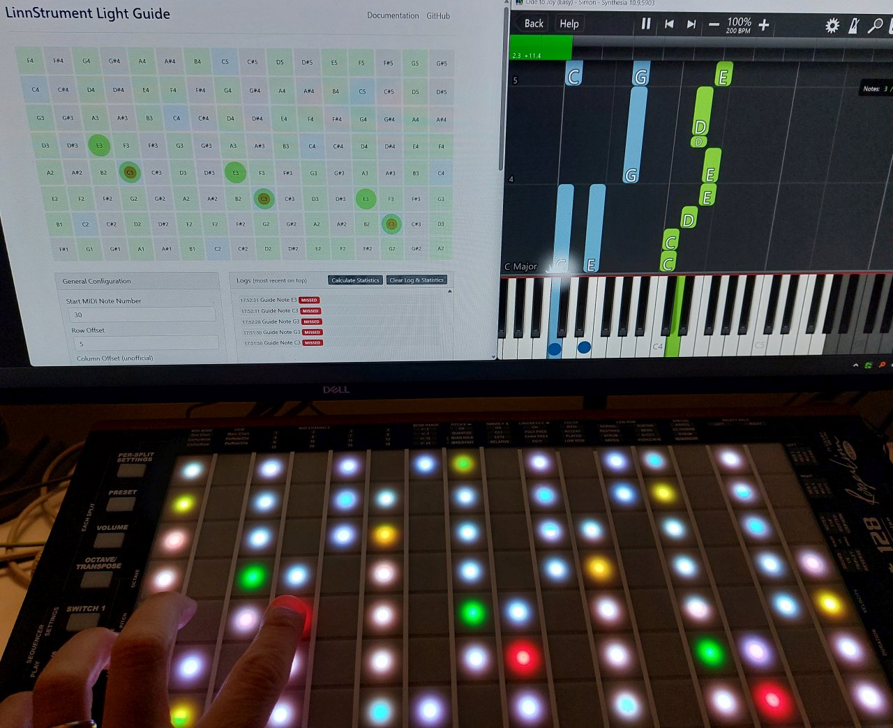
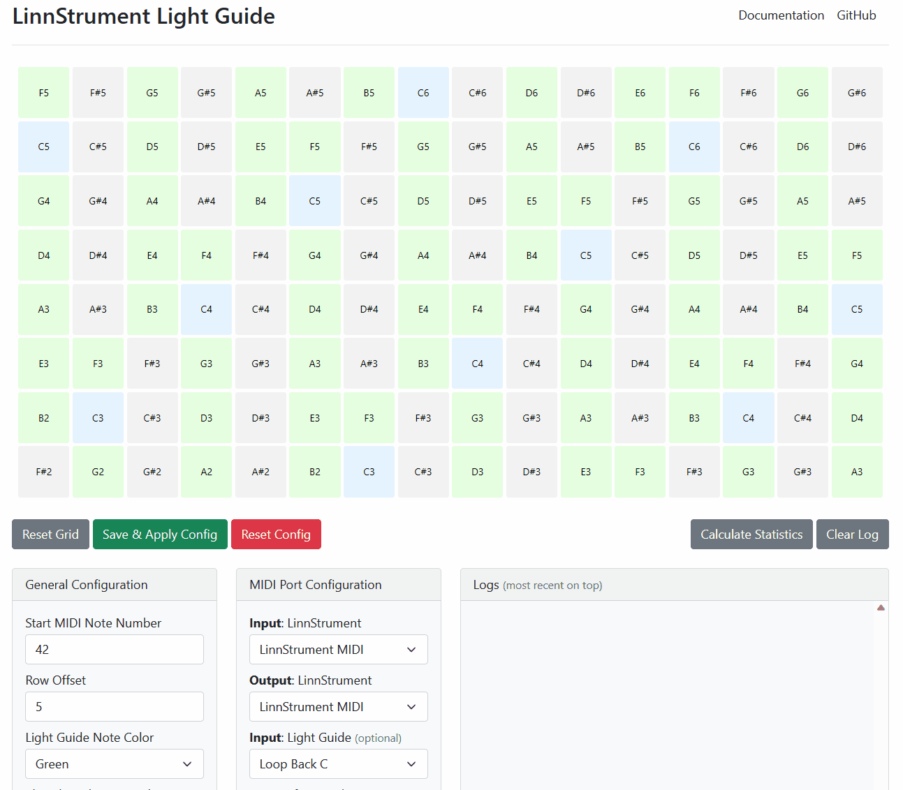
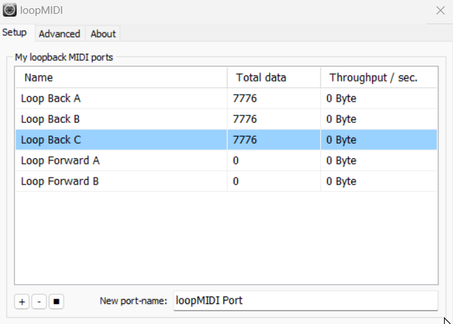
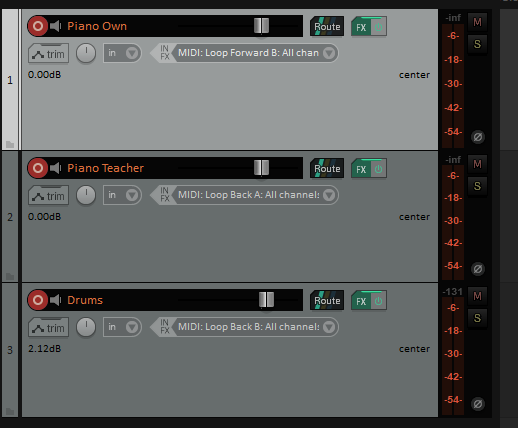
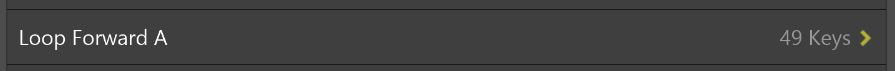
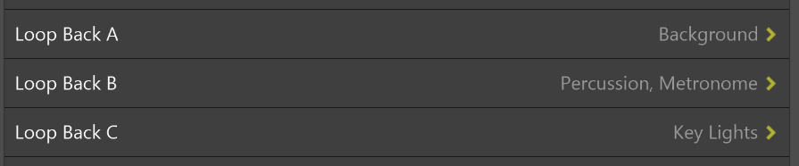

# LinnStrument Light Guide Support

## Description

> This is available as a [web app](https://fannon.github.io/linnstrument-light-guide/). You can use in any modern browser.

Some keyboard learning tools like [Synthesia](https://synthesiagame.com/) offer a "Light Guide" feature for certain keyboards.
LinnStrument is not directly supported by Synthesia, but this app adds indirect support.

In principle this app could work with any program that sends Light Guide MIDI information, assuming that the Light Guide MIDI input port sends note-on and note-off messages. 

It can also be used in general to visualize the grid layout and how it is played. 

See also this demo GIF (click play if necessary):

## User Guide

Setting this up with Synthesia is a big fiddly, as it needs a few MIDI loop devices to route MIDI information from and to the right places.
Personally, I'm also using a DAW to hear my own notes, synthesia notes and drums / metronome with low latency.

* You need to have a virtual MIDI Loop Device (e.g. loopMIDI) where Synthesia sends KeyLights to the Output.
  * On Windows you can use a tool like [loopMIDI](https://www.tobias-erichsen.de/software/loopmidi.html)
  * You need to setup at least two Loop ports:
    * One for receiving forwarded LinnStrument MIDI notes (This scripts defaults to `Loop Forward A`)
    * One for sending Synthesia Light Guide information (This scripts defaults to `Loop Back C`)
  * Personally, I've set up three more Loop Devices, so I can use my DAW to hear / mix everything with low latency:
    * One for sending Synthesia background MIDI (teachers piano) to my DAW (`Loop Back A`)
    * One for sending Synthesia drum & metronome MIDI (teachers piano) to my DAW (`Loop Back B`)
    * One for sending LinnStrument MIDI notes to the DAW (`Loop Forward B`)

* Optionally: Setup a DAW to hear your own and Synthesias sounds in real-time without latency. I've setup three tracks:
  * Own Piano: Listens to `Loop Forward B` (which is the MIDI Thru of LinnStrument)
  * Teachers Piano: Listens to `Loop Back A` to play Synthesia notes
  * Drums & Metronome: Listens to `Loop Back B` to play Synthesia drum and metronome sounds

* Configure Synthesia Music Input:
  * Receive player notes from `Loop Forward A`

* Configure Synthesia Music Output:
  * Send "Key Lights" to `Loop Back C`, using the "ONE Smart Piano" or any of the channels mode, e.g. "Finger-based channel".
    * The "ONE Smart Piano" option seems to work most reliable?
  * Optional: Send "Background" to `Loop Back A`.
  * Optional: Send "Percussion, Metronome" to `Loop Back B`.

Now everything should be ready. Start the webapp at https://fannon.github.io/linnstrument-synthesia-light-guide/.
Make sure to use a modern browser that supports WebMIDI like Google Chrome or MS Edge.

Make sure that the configuration is correct and matches your MIDI input and output ports.

Have fun :)

## TODO and Ideas

* It would be nice to detect mistakes / timing problems and create statistics - based on a comparison of guide notes and actually played notes.

## Developer Guide

* Install Node.js if not there
* Check out this repository
* Run `npm install`
* Run `npm start` 
