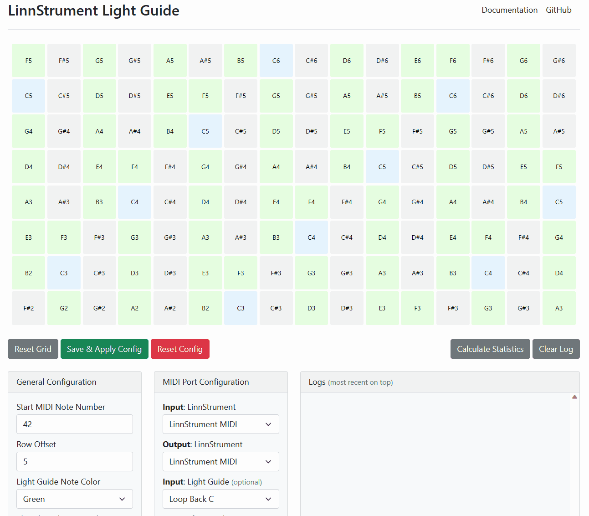

# LinnStrument Light Guide Support

## Description

This [web app](https://fannon.github.io/linnstrument-light-guide/) allows you to visualize a LinnStrument a modern, [Web MIDI enabled browser](https://caniuse.com/midi). 
It also shows notes that are currently played and optionally optionally guide notes from a second source.
If such guide notes (also referred to as Light Guide feature) are used, the tool also highlights them on the LinnStrument and the app can compare the played notes to the guide notes.
This can be a useful tool for learning to play or to jam along with a second MIDI note source with visual feedback.

Some keyboard learning tools like [Synthesia](https://synthesiagame.com/) offer a "Light Guide" feature for certain keyboards.
LinnStrument is not directly supported by Synthesia, but with this app it is still possible to use the light guide feature.
See [User Guide for Synthesia](#synthesia).

In principle this app works with any Light Guide source that sends MIDI notes or Light Guide messages.

## Pictures and GIFs

## User Guide

### Any MIDI Source

In principle any MIDI source can be selected as Light Guide input in the app. The MIDI note-on and note-off events from that source will then be visualized and the played notes compared against it. 
For an example, see [Scaler 2](#scaler-2).

### Scaler 2

I found [Scaler 2](https://www.scalerplugin.com/) to be a very useful input source for Light Guide notes as well. 
It can play chords but also patterns based on the chords.  

* You need to have a virtual MIDI Loop Device (e.g. loopMIDI) through which Scaler 2 can send its MIDI out to this app.
  * On Windows you can use a tool like [loopMIDI](https://www.tobias-erichsen.de/software/loopmidi.html)
  * You need to setup two MIDI loop ports,
    * One where Scaler 2 can send its MIDI output to, e.g. with the name `Loop Back A`
    * One where the app can send back the received LinnStrument MIDI notes back (like MIDI Thru) to a VSTi, so you can hear your own notes, e.g. `Loop Forward A`
* Start the app and configure 
  * `Input: Light Guide` to use previously setup loop port (e.g. `Loop Back A`)
  * `Forward: MIDI Thru 1` to forward the LinnStrument notes to the DAW VSTi for your own sound (e.g. `Loop Forward A`)
* Start a DAW of your choice and setup two tracks:
  * Load Scaler 2 and route its MIDI outport to the `Loop Back A` device
  * Load a VSTi of your choice and use the MIDI Thru port as input, e.g. `Loop Forward A`
* Tip: Also add some drums or other backing track elements and use your DAW time, play and stop controls. 

### Synthesia

Setting this up with Synthesia is a big fiddly, as it needs a few MIDI loop devices to route MIDI information from and to the right places.
Personally, I'm also using a DAW to hear my own notes, synthesia notes and drums / metronome with low latency.

* You need to have a virtual MIDI Loop Device (e.g. loopMIDI) where Synthesia sends KeyLights to the Output.
  * On Windows you can use a tool like [loopMIDI](https://www.tobias-erichsen.de/software/loopmidi.html)
  * You need to setup at least two Loop ports:
    * One for receiving forwarded LinnStrument MIDI notes (This scripts defaults to `Loop Forward A`)
    * One for sending Synthesia Light Guide information (This scripts defaults to `Loop Back C`)
  * Personally, I've set up three more Loop Devices, so I can use my DAW to hear / mix everything with low latency:
    * One for sending Synthesia background MIDI (teachers piano) to my DAW (`Loop Back A`)
    * One for sending Synthesia drum & metronome MIDI (teachers piano) to my DAW (`Loop Back B`)
    * One for sending LinnStrument MIDI notes to the DAW (`Loop Forward B`)

* Optionally: Setup a DAW to hear your own and Synthesias sounds in real-time without latency. I've setup three tracks:
  * Own Piano: Listens to `Loop Forward B` (which is the MIDI Thru of LinnStrument)
  * Teachers Piano: Listens to `Loop Back A` to play Synthesia notes
  * Drums & Metronome: Listens to `Loop Back B` to play Synthesia drum and metronome sounds

* Configure Synthesia Music Input:
  * Receive player notes from `Loop Forward A`

* Configure Synthesia Music Output:
  * Send "Key Lights" to `Loop Back C`, using the "ONE Smart Piano" or any of the channels mode, e.g. "Finger-based channel".
    * The "ONE Smart Piano" option seems to work most reliable?
  * Optional: Send "Background" to `Loop Back A`.
  * Optional: Send "Percussion, Metronome" to `Loop Back B`.

Now everything should be ready. Start the webapp at https://fannon.github.io/linnstrument-synthesia-light-guide/.
Make sure to use a modern browser that supports WebMIDI like Google Chrome or MS Edge.

Make sure that the configuration is correct and matches your MIDI input and output ports.

Have fun :)

## TODO and Ideas

* Create a GitHub issue in this project if you have an idea or run into a problem.

## Developer Guide

* Install Node.js if not there
* Check out this repository
* Run `npm install`
* Run `npm start` 
